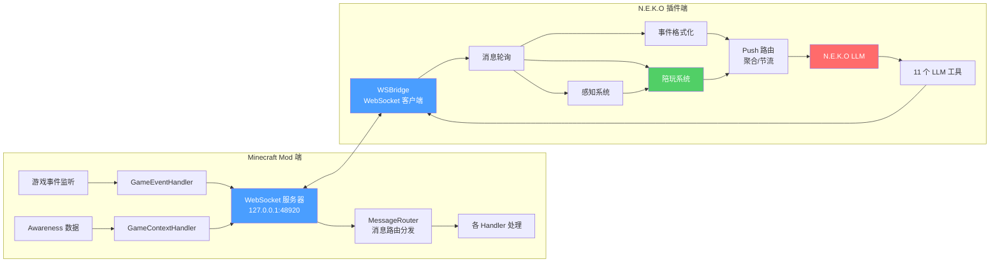

# N.E.K.OxTLM

一个联动插件，为"车万女仆"（Touhou Little Maid）模组与 N.E.K.O 搭建兼容与交互桥梁，可借助 N.E.K.O 通过自然语言控制游戏内女仆行为。

> 新手上路？请阅读 [使用教程](使用教程.md)

## 架构流程



## 功能特性

- **伙伴型 AI 女仆** — 女仆不再是仆从，而是陪你一起玩的伙伴。会害怕、会撒娇、会吐槽、会关心你
- **WebSocket 桥接** — 在 Minecraft 服务端启动 WebSocket 服务器，N.E.K.O 客户端通过 WebSocket 协议实时交互
- **女仆状态查询** — 获取所有女仆的生命值、位置、任务、装备等详细信息
- **女仆行为控制** — 通过自然语言指令控制女仆的跟随/停留、坐下/站起、切换任务、切换日程、装备物品等
- **游戏事件推送** — 将女仆受伤/死亡、玩家受伤/死亡/击杀、天气变化、昼夜变化、群系切换、维度切换、成就解锁、背包物品变化、方块活动、容器交互、钓鱼、棋局等事件实时推送给 N.E.K.O
- **定时感知系统** — 每 5 秒轮询游戏状态，检测玩家血量/饥饿/着火/溺水、附近敌对生物、矿洞暗处、食物分享等，主动关心或提醒
- **陪玩式感知增强** — 记录最近共同经历，推断玩家当前活动状态，并在长时间稳定游玩时低频主动陪一句；主动建议与小游戏陪伴
- **上下文注入** — 持续更新玩家手持物品、附近结构/地标等信息到 LLM 上下文，为主动搭话提供素材
- **Push 聚合与节流** — 低优先级上下文会短窗口合并后按时间顺序注入，紧急提醒和聊天消息仍会立即响应
- **女仆聊天** — 让女仆在游戏内发送聊天消息并显示聊天气泡（TTS 由 N.E.K.O 处理，避免重复，LLM 自主判断）
- **技能系统** — 查询和使用车万女仆的 AI 技能（Skill）
- **指令执行（需确认）** — N.E.K.O 可请求执行 Minecraft 指令，但需要玩家在游戏内点击确认，防止滥用
- **游戏内目标板** — 在 Minecraft 右上角 HUD 显示当前 Minecraft 目标与步骤，支持 LLM 结构化更新和玩家输入（`/neko plan`）

## 环境要求

| 依赖                        | 版本                     |
| ------------------------- | ---------------------- |
| Minecraft                 | 1.21.1                 |
| NeoForge                  | 21.1.172+              |
| Java                      | 21                     |
| 车万女仆 (Touhou Little Maid) | 1.5.3+（可选，但无此模组本插件无意义） |

## 安装

1. 确保已安装 Minecraft 1.21.1 + NeoForge
2. 安装车万女仆模组
3. 将本模组 JAR 文件放入 `mods` 文件夹
4. 启动游戏

## 配置

在游戏内通过 Mod 菜单或配置文件 `neko_tlm_bridge-common.toml` 进行配置：

### 桥接配置

| 配置项                       | 默认值     | 说明                                         |
| ------------------------- | ------- | ------------------------------------------ |
| `nekoModeEnabled`         | `true`  | 启用 N.E.K.O 模式，开启后女仆的 AI 对话由 N.E.K.O 驱动     |
| `websocket.port`          | `48920` | WebSocket 服务器监听端口                          |
| `ignoreTlmBuiltinContext` | `true`  | 忽略车万女仆内置 AI 上下文，防止与 N.E.K.O 冲突             |
| `eventPushEnabled`        | `true`  | 启用游戏事件推送，将游戏事件通过 WebSocket 推送给 N.E.K.O     |
| `commandExecutionEnabled` | `false` | 启用指令执行，允许 N.E.K.O 请求执行 Minecraft 指令（需玩家确认） |
| `chatBubbleEnabled`       | `true`  | 启用聊天气泡显示                                   |
| `chatBoxEnabled`          | `true`  | 启用聊天框消息显示                                  |
| `weatherEventEnabled`     | `true`  | 启用天气变化事件推送                                 |
| `timeEventEnabled`        | `true`  | 启用昼夜变化事件推送                                 |

### 行为与方块活动聚合配置

| 配置项                       | 默认值     | 说明                                         |
| ------------------------- | ------- | ------------------------------------------ |
| `behaviorAggregateIdleTicks`    | `80`    | 受伤/击杀行为聚合空闲 tick 阈值（超出后自动刷出） |
| `behaviorAggregateMaxWindowTicks` | `160` | 受伤/击杀行为聚合最大窗口 tick           |
| `blockActivityIdleTicks`  | `60`    | 方块活动聚合空闲 tick 阈值             |
| `blockActivityMaxWindowTicks` | `400` | 方块活动聚合最大窗口 tick             |
| `blockActivityMinCount`   | `4`     | 方块活动聚合最少方块数阈值                |

## WebSocket 协议

本模组在 `127.0.0.1:{port}` 上启动 WebSocket 服务器，仅接受本地连接。所有消息均为 JSON 格式。

### 请求消息

客户端发送的消息需包含 `type` 字段和可选的 `request_id` 字段：

```json
{
  "type": "消息类型",
  "request_id": "可选的请求ID，用于匹配响应",
  "data": { ... }
}
```

#### 支持的请求类型

| 类型                 | 说明                | data 字段                                             |
| ------------------ | ----------------- | --------------------------------------------------- |
| `ping`             | 心跳检测              | 无                                                   |
| `get_maid_status`  | 获取所有女仆状态          | 无                                                   |
| `command_maid`     | 控制女仆行为            | `maid_id`, `command`, `args`                        |
| `send_chat`        | 让女仆发送聊天消息         | `maid_id`, `message`                                |
| `get_game_context` | 获取游戏上下文           | `category`, `maid_id`(可选)                           |
| `use_skill`        | 使用/查询技能           | `skill_name`, `maid_id`(可选)                         |
| `attack_target`    | 指定女仆攻击目标（实验性，未暴露给LLM） | `maid_id`, `target_entity_id` 或 `target_entity_ids` |
| `execute_command`  | 请求执行 Minecraft 指令 | `command`                                           |
| `get_config`       | 获取当前配置            | 无                                                   |
| `set_monitored_maid` | 设置监控的女仆ID（用于背包物品变化检测） | `maid_id`                           |
| `set_plan`         | 设置游戏内 HUD 计划文本  | `plan`（空字符串清除；插件侧可由结构化目标板生成）          |
| `get_plan`         | 获取当前游戏内 HUD 计划文本 | 无（返回 `plan_result`）                              |

#### command\_maid 支持的指令

| command           | args                                 | 说明      |
| ----------------- | ------------------------------------ | ------- |
| `switch_follow`   | `{"follow": true/false}`             | 切换跟随/停留 |
| `switch_sit`      | `{"sit": true/false}`                | 切换坐下/站起 |
| `switch_task`     | `{"task": "任务ID"}`                   | 切换女仆任务  |
| `switch_schedule` | `{"schedule": "DAY/NIGHT/ALL"}`      | 切换日程模式  |
| `equip_item`      | `{"slot": 槽位号}` 或 `{"item": "物品ID"}` | 装备物品到主手 |

Python 插件侧的 `mc_switch_task` 会在命令返回成功后再次查询 `get_maid_status`，用 `verified/current_task/expected_task` 确认女仆实际任务是否切换成功。若任务名无法匹配或 mod 端拒绝切换，工具会返回结构化的 `TASK_SWITCH_RECOVERABLE`，包含 `available_tasks` 和 `retry_hint`，LLM 应选择精确任务 ID/名称后立即重试。

#### get\_game\_context 支持的类别

| category          | 说明               |
| ----------------- | ---------------- |
| `world`           | 世界信息（时间、天气、在线玩家） |
| `status`          | 女仆状态（生命值、任务、日程）  |
| `equipment`       | 女仆装备与背包          |
| `user`            | 女仆主人信息（含着火/溺水状态） |
| `effects`         | 女仆当前药水效果         |
| `position`        | 女仆与主人的位置（含亮度/地下） |
| `nearby_entities` | 女仆附近实体           |
| `awareness`       | 感知系统综合数据（一次返回所有 awareness 需要的信息，含玩家经验等级、装备耐久度等） |

### 响应消息

服务端返回的消息格式：

```json
{
  "type": "响应类型",
  "request_id": "对应的请求ID",
  "data": { ... }
}
```

#### 响应类型

| 类型                         | 说明               |
| -------------------------- | ---------------- |
| `pong`                     | 心跳响应             |
| `maid_status`              | 女仆状态数据           |
| `command_result`           | 指令执行结果           |
| `chat_result`              | 聊天发送结果           |
| `game_context`             | 游戏上下文数据          |
| `skill_result`             | 技能查询/使用结果        |
| `attack_target_result`     | 攻击目标设置结果（实验性，未暴露给LLM） |
| `command_execution_result` | Minecraft 指令执行结果 |
| `config`                   | 当前配置             |
| `config_update`            | 配置变更推送           |
| `plan_update`              | 计划变更推送（玩家通过命令设置时） |
| `plan_result`              | 计划设置结果           |
| `event`                    | 游戏事件推送           |
| `chat_message`             | 聊天消息推送           |
| `error`                    | 错误信息             |

### 事件推送

当启用事件推送时，服务端会主动向客户端推送以下事件：

| 事件类型                | 说明                          | data 字段                                          |
| ------------------- | --------------------------- | ------------------------------------------------- |
| `maid_hurt`         | 女仆受伤                        | `maid_id`, `maid_name`, `damage`, `source`        |
| `maid_death`        | 女仆死亡                        | `maid_id`, `maid_name`, `killer`(可选), `cause`    |
| `player_hurt`       | 玩家受伤（行为聚合统计）                | `player_name`, `count`, `total_damage`, `primary_target`, `last_attacker`, `includes_maid`, `last_health`, `last_max_health` |
| `player_kill_entity`| 玩家击杀实体（行为聚合统计）              | `player_name`, `count`, `primary_target`, `last_target` |
| `player_death`      | 玩家死亡                        | `player_name`, `cause`                            |
| `advancement`       | 玩家解锁成就（仅含有 toast 的成就）       | `player_name`, `title`, `description`             |
| `biome_change`      | 群系切换（10秒防抖，避免边界反复触发）        | `maid_id`, `maid_name`, `biome`, `old_biome`      |
| `weather_change`    | 天气变化                        | `is_raining`, `is_thundering`                     |
| `time_phase_change` | 昼夜变化                        | `phase`("day"/"night"), `day_time`                |
| `inventory_change`  | 背包物品变化（开→快照，关→diff，无变化不推送）  | `maid_id`, `player_name`, `added`, `removed`      |
| `block_activity`    | 方块活动聚合（破坏/放置同一批方块合并推送）      | `player_name`, `action`, `count`, `primary_block`, `tendency`, `top_blocks` |
| `container_interaction` | 女仆主人打开/关闭容器（仅作为整理物品证据） | `maid_id`, `player_name`, `action`, `container_type` |
| `fishing_start`     | 女仆主人开始使用鱼竿                     | `maid_id`, `player_name`, `x`, `y`, `z`            |
| `item_fished`       | 女仆主人钓到物品                         | `maid_id`, `player_name`, `drops`, `rod_damage`   |
| `chess_game_start`  | 棋局开始（五子棋/国际象棋/中国象棋）         | `game_type`, `opponent`                           |
| `chess_mid_game`    | 棋局中盘                         | `game_type`, `move_count`, `is_maid_turn`, `board`/`fen` |
| `chess_game_end`    | 棋局结束                         | `game_type`, `result`("win"/"lose"/"draw"), `opponent`, `move_count` |
| `dimension_change`  | 玩家维度切换                       | `player_name`, `from_dimension`, `to_dimension` |
| `chat`              | 玩家聊天消息                      | `sender`, `message`                               |

## 感知系统

Python 侧插件按配置的 `awareness_interval` 轮询游戏状态（通过 `awareness` category 一次获取所有数据），检测以下情况：

### 需要回复的事件（ai_behavior="respond"）

| 检测项       | 条件              | 冷却   | 示例发言                   |
| --------- | --------------- | ---- | ---------------------- |
| 复仇情绪      | 死亡后复活           | 一次性  | "刚才那只骷髅呢？我要打回去！"      |
| 低血量警告     | 玩家血量 < 30%      | 5分钟  | "你血量好低！要小心啊！"         |
| 着火警告      | 玩家着火            | 2分钟  | "着火了！快灭火！"             |
| 溺水警告      | 玩家溺水            | 2分钟  | "快上岸！要淹到了！"            |
| 饥饿警告      | 玩家饥饿值 ≤ 6      | 5分钟  | "快饿死了！赶紧吃东西！"         |
| 饥饿提醒      | 饥饿值 ≤ 12 且有危险   | 10分钟 | "饥饿值偏低，还在危险中，注意补给！" |
| 近处敌对生物    | 新敌对生物 < 10格     | 3分钟  | "危险！附近有苦力怕x2！"        |
| 食物分享      | 有食物 + 玩家血量 < 70% | 5分钟  | "你饿不饿？我这里有点吃的～"       |
| 矿洞暗处      | 地下 + 亮度 < 7     | 10分钟 | "这里好暗...要不要我帮忙插火把？"   |
| 玩家远离      | 距离 > 50格        | 1分钟  | "伙伴走好远了...要去哪里呀？"     |
| 玩家归来      | 距离 < 30格（从远变近）  | 1分钟  | "伙伴回来了！太好了～"          |

### 仅注入上下文（ai_behavior="read"）

| 检测项     | 条件             | 说明                   |
| ------- | -------------- | -------------------- |
| 玩家手持物品  | 物品变化时（2次检测防抖）  | "伙伴手持物品: minecraft:diamond_swordx1" |
| 附近结构/地标 | 新发现的结构（128格内）  | "附近发现结构: minecraft:village (距离45.0格)" |
| 女仆背包变化  | 背包物品列表变化时      | "女仆背包状态已更新，共N件物品" |
| 容器交互    | 女仆主人打开/关闭容器    | 用于判断玩家可能正在整理物品，不直接打扰 |
| 钓鱼开始    | 女仆主人使用鱼竿       | 用于判断玩家进入钓鱼/等待节奏 |
| 玩家进度上下文 | awareness 数据携带 | 玩家经验等级 `player_experience_level`、当前等级进度 `player_experience_progress`（0-1）、装备耐久度 `player_equipment_durability`（主手/副手/头/胸/腿/脚 6 槽，仅记录有耐久度的物品，含 `durability_ratio`）；LLM 通过 `mc_game_context(awareness)` 主动查询，不主动推送 |

### 陪玩式感知

在普通安全提醒之外，Python 侧插件还维护了一层低打扰的陪玩上下文：

| 能力 | 说明 |
| ---- | ---- |
| 短期共同经历 | 记录最近 Minecraft 事件、聊天、感知变化和活动变化，按时间顺序整理成摘要 |
| 活动状态推断 | 基于 awareness 数据和短期证据推断玩家大致处于挖矿、地下探索、建家、危险探索、钓鱼、赶路、采集整理、整理物品、刷怪、闲置、战斗、远离、红石工程、下界探索、末地探索、村民交易等阶段 |
| 安静陪伴触发 | 玩家稳定处于适合陪伴的状态一段时间后，按场景低频触发一句简短自然的陪玩回应 |
| 主动建议触发 | 根据场景（暗处缺火把、挖矿缺光、建造有材料、钓鱼/赶路/整理/刷怪等）生成一句话建议 |
| 小游戏陪伴 | 棋局事件（五子棋/国际象棋/中国象棋）特殊处理，含冷却和上下文裁剪 |
| 短期共同目标 | 当前会话内维护"正在一起做什么"，如一起下矿、建家、下棋、赶路，不替代宿主长期记忆 |
| 游戏内目标板 | 在 Minecraft 右上角 HUD 显示当前 Minecraft 目标与步骤。LLM 通过 `mc_set_plan(title, steps, completed_steps, append_steps)` 维护结构化状态，插件发送纯文本给 HUD；插件面板可查看、改标题、追加步骤、标记完成/未完成、清空；玩家仍可通过 `/neko plan` 命令直接设置文本 |
| 陪玩调试日志 | 可选记录事件路由、活动变化、quiet/suggestion/push 触发原因到插件 `log` 目录，便于实测调参 |
| 低优先级聚合 | 活动变化、短期记忆等 `read` 上下文会短窗口合并，避免短时间大量 push |
| 高优先级直通 | 聊天、死亡、低血量、溺水、着火、近处敌怪等仍会立即 `respond` |

当前陪玩触发偏保守：不明确的 `unknown`、泛化的 `exploring`、危险探索 `danger_exploring`、战斗中 `combat`、采集整理 `gathering`、整理物品 `organizing`、村民交易 `trading`、玩家远离 `away` 时不会触发安静陪伴，避免乱报和打扰。

### Push 聚合与 coalesce_key 节流

主动回复推送（`ai_behavior="respond"`）使用分组覆盖机制：相同 `coalesce_key` 的新推送自动覆盖旧的未消费推送，避免 LLM 忙时堆积过时回复。

| coalesce_key | 覆盖范围 | 示例事件 |
| ------------ | -------- | -------- |
| `mc_alert` | 紧急警报 | 受伤、低血量、着火、溺水 |
| `mc_awareness` | 非紧急感知 | 敌怪出现、饥饿提醒 |
| `mc_event` | 环境变化 | 群系/天气/昼夜/背包/钓鱼 |
| `mc_activity` | 活动状态变化 | 挖矿→钓鱼等 |
| `mc_companion` | 安静陪伴 | 陪伴搭话 |
| `mc_suggestion` | 主动建议 | 场景化建议 |
| `mc_chess` | 棋局事件 | 中盘反馈 |

聊天消息、死亡事件、成就解锁、维度切换不设 key（每条独立保留，不覆盖）。

### N.E.K.O 插件侧配置

以下配置位于 `neko_tlm/plugin.toml` 的 `[minecraft_bridge]` 段：

#### 连接配置

| 配置项 | 默认值 | 说明 |
| ------ | ------ | ---- |
| `ws_url` | `ws://127.0.0.1:48920` | WebSocket 连接地址（端口也可通过插件面板"保存端口"按钮动态修改，自动重启桥接） |
| `heartbeat_interval` | `30` | 心跳间隔，单位秒 |
| `reconnect_interval` | `5` | 断线重连间隔，单位秒 |
| `max_reconnect_interval` | `60` | 最大重连间隔，单位秒 |
| `companion_mode` | `standard` | 陪玩活跃度预设：`quiet` 安静、`standard` 标准、`active` 活跃、`custom` 自定义 |
| `awareness_interval` | `5` | awareness 轮询间隔，单位秒 |

#### 陪玩系统配置

当 `companion_mode` 为 `quiet`、`standard` 或 `active` 时，插件只覆盖主动搭话频率相关的 3 个参数：`playmate_quiet_stable_seconds`、`playmate_quiet_cooldown`、`playmate_suggestion_cooldown`；当 `companion_mode = "custom"` 时，使用这 3 个参数的手动配置。该模式不控制 Minecraft 感知频率、活动防抖、消息聚合、防刷屏限流、N.E.K.O 宿主模型、TTS 或全局工具调用策略。

| 配置项 | 默认值 | 说明 |
| ------ | ------ | ---- |
| `playmate_memory_items` | `24` | 短期共同经历最多保存条数 |
| `playmate_memory_summary_length` | `120` | 单条短期记忆摘要最大长度 |
| `playmate_memory_inject_items` | `8` | 注入共同经历时最多使用条数 |
| `playmate_memory_inject_chars` | `700` | 注入共同经历文本最大长度 |
| `playmate_activity_debounce_checks` | `2` | 活动状态需要连续命中几次才确认 |
| `playmate_activity_cooldown` | `120` | 活动状态变化冷却时间，单位秒 |
| `playmate_quiet_stable_seconds` | `90` | 多久没动静后允许触发陪伴发言 |
| `playmate_quiet_cooldown` | `300` | 陪伴发言冷却时间，单位秒 |
| `playmate_aggregate_window` | `8` | 低优先级上下文聚合窗口，单位秒 |
| `playmate_throttle_window` | `30` | push 节流统计窗口，单位秒 |
| `playmate_throttle_limit` | `6` | 节流窗口内允许的 push 次数 |
| `playmate_minigame_feedback_cooldown` | `90` | 小游戏（棋局）中盘反馈冷却时间，单位秒 |
| `playmate_minigame_context_chars` | `90` | 小游戏陪伴上下文最大字符数 |
| `playmate_suggestion_cooldown` | `600` | 主动建议发言冷却时间，单位秒 |
| `playmate_debug_log_enabled` | `false` | 是否启用陪玩调试日志 |
| `playmate_debug_log_max_bytes` | `262144` | `log/playmate_debug.log` 最大大小，超出后保留尾部内容 |

#### 桥接诊断

插件面板提供“诊断桥接”动作，也可通过 `diagnose_bridge` entry 调用。诊断范围包括 Java/Minecraft 进程、WebSocket 连接、Minecraft mod 配置、聊天显示开关、女仆状态和已指定女仆。该诊断只覆盖本插件与 Minecraft mod 的桥接边界；N.E.K.O 宿主模型、TTS、全局工具调用偏置需在宿主侧检查。

## 游戏内指令

| 指令                          | 说明                            |
| --------------------------- | ----------------------------- |
| `/neko accept <pending_id>` | 确认执行 N.E.K.O 请求的 Minecraft 指令 |
| `/neko reject <pending_id>` | 拒绝 N.E.K.O 请求的 Minecraft 指令   |
| `/neko plan <text>`        | 设置游戏内右上角 HUD 显示的目标板文本    |
| `/neko plan clear`         | 清除 HUD 目标板显示                    |

当 N.E.K.O 请求执行指令时，所有在线玩家会收到带有可点击按钮的提示消息。

## 项目结构

### Minecraft Mod 端（Java/NeoForge）

```
minecraft-mod/src/main/java/com/neko_tlm_bridge/
├── NekoTlmBridge.java          # 模组主类，生命周期管理与 handler 初始化
├── client/
│   ├── NekoConfigScreen.java   # 配置界面
│   └── PlanOverlayRenderer.java # 计划 HUD 渲染
├── config/
│   └── ModConfig.java          # 配置定义
├── event/
│   └── GameEventHandler.java   # 游戏事件监听与推送（受伤/死亡/天气/昼夜/群系/维度/背包/成就/方块/钓鱼/棋局）
├── tlm/
│   ├── LittleMaidCompat.java       # 车万女仆 API 扩展注册
│   ├── NekoBridgeTool.java         # AI 工具：消息转发到 N.E.K.O
│   ├── NekoExtraMaidBrain.java     # 女仆额外行为注册
│   ├── NekoAttackTargetBehavior.java  # 自定义攻击行为
│   ├── NekoAttackTargetStore.java     # 攻击目标存储与管理
│   └── NekoWebSocketServerHolder.java # WebSocket 服务器引用持有
└── ws/
    ├── NekoWebSocketServer.java     # WebSocket 服务器实现
    ├── NekoCommand.java             # 游戏内指令注册
    ├── PendingCommandManager.java   # 待确认指令管理
    ├── Protocol.java                # 协议常量定义
    └── handler/                     # 消息处理器（模块化拆分）
        ├── MessageHandlerInterface.java  # Handler 公共接口
        ├── MessageRouter.java            # 消息路由分发 + 主线程队列
        ├── MaidStatusHandler.java        # 女仆状态查询
        ├── CommandMaidHandler.java       # 女仆控制命令（跟随/坐下/任务/日程/装备）
        ├── GameContextHandler.java       # 游戏上下文查询（8种 category + awareness）
        ├── ChatHandler.java             # 聊天消息发送
        ├── CommandExecutionHandler.java  # 服务器命令执行（需玩家确认）
        ├── AttackTargetHandler.java     # 攻击目标管理
        ├── SkillHandler.java            # 技能查询与使用
        ├── ConfigHandler.java           # 配置查询与监控女仆设置
        ├── SetPlanHandler.java          # 计划设置处理
        ├── GetPlanHandler.java          # 计划查询处理
        └── MaidHelper.java              # 女仆查找共享工具方法
```

### N.E.K.O 插件端（Python）

```
neko_tlm/               # 酒狐插件（plugin_id: neko_tlm）
├── __init__.py          # 插件主类：生命周期、消息分发、@llm_tool 声明、UI
├── instructions.py      # AI 指令模板（注入到 LLM 上下文的系统提示词）
├── task_resolver.py     # 任务名解析与模糊匹配（中文同义词 → TLM 任务 ID）
├── bridge.py            # WebSocket 桥接层（连接、重连、心跳、收发队列、MC进程检测）
├── config.py            # 配置加载/保存/同步（TOML 格式）
├── events.py            # 游戏事件格式化（事件数据 → 角色化文本 + 优先级 + 棋局局面描述）
├── awareness.py         # 感知系统（定时轮询、状态检测、cooldown 管理）
├── diagnostics.py       # 桥接诊断（连接、mod 配置、女仆状态、宿主边界提示）
├── plan.py              # 当前 Minecraft 目标板结构化状态、文本解析与 HUD 文本渲染
├── playmate/            # 陪玩式感知增强
│   ├── __init__.py      # 子包导出入口
│   ├── context.py       # 陪玩上下文总协调器
│   ├── memory.py        # 短期共同经历记忆
│   ├── activity.py      # 玩家活动状态推断（18种状态分类）
│   ├── quiet.py         # 安静陪伴触发器
│   ├── suggestion.py    # 主动建议触发器（场景化轻量建议）
│   ├── minigame.py      # 小游戏陪伴（棋局事件处理/冷却/上下文裁剪）
│   ├── push.py          # Minecraft 上下文 push 聚合与节流
│   └── debug_log.py     # 陪玩调试日志
├── tools.py             # LLM 工具业务逻辑（11个 do_* 函数）
├── tool_defs.py         # LLM 工具元数据常量（name/description/parameters）
├── plugin.toml          # 插件描述与运行时配置
├── ui/
│   └── panel.tsx        # 仪表盘 UI 面板
└── i18n/
    ├── zh-CN.json       # 中文翻译
    └── en.json          # 英文翻译
```

## 构建

```bash
./gradlew.bat build
```

构建产物位于 `build/libs/` 目录下。

## 插件仓库同步

`master` 分支中 `neko_tlm/` 的变更会由
`.github/workflows/sync-neko-tlm-plugin.yml` 单向同步到独立仓库
`n.e.k.o_plugin_neko_tlm` 的 `main` 分支。主仓需要配置具有目标仓库
`Contents: Read and write` 权限的 Repository Secret：`NEKO_TLM_REPO_TOKEN`。

发布 tag 不会自动同步。市场审核通过后，请在独立插件仓库的对应提交上创建
与 `plugin.toml` 版本一致的 `v*` tag。

## 许可证

MIT License

## 致谢

- [车万女仆 (Touhou Little Maid)](https://github.com/TartaricAcid/TouhouLittleMaid) — 提供了优秀的女仆系统与 AI 扩展 API
- [N.E.K.O](https://github.com/Project-N-E-K-O/N.E.K.O) — 自然语言 AI 控制框架（猫娘）
